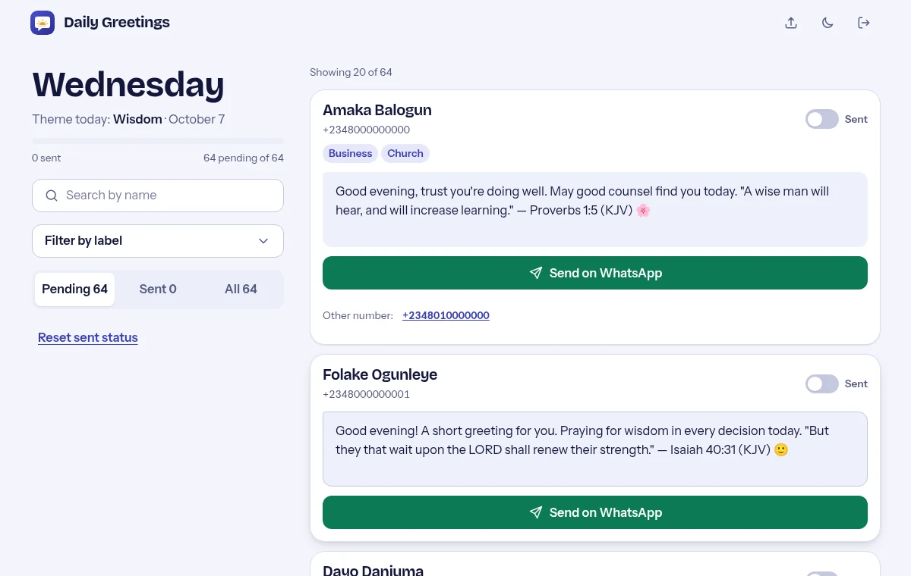
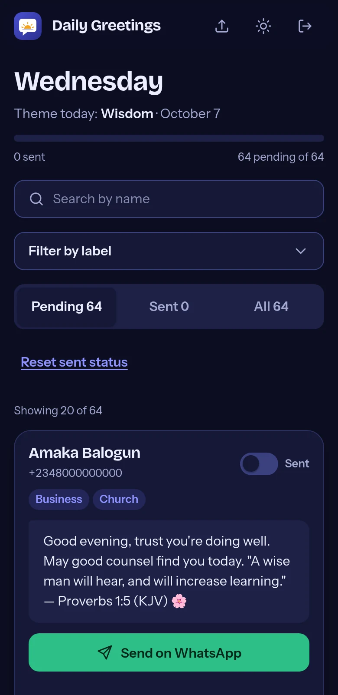

<p align="center">
  
</p>

<h1 align="center">Daily Greetings</h1>

<p align="center">Themed WhatsApp greetings with a Bible verse, ready to send in one tap.</p>

<p align="center">
  <a href="https://github.com/babatundeawo/wa-greetings/actions/workflows/deploy.yml"></a>
  <a href="https://github.com/babatundeawo/wa-greetings/actions/workflows/codeql.yml"></a>
</p>

<p align="center">
  <a href="https://babatundeawo.github.io/wa-greetings/">Live site</a> ·
  <a href="docs/DEPLOYMENT.md">Documentation</a> ·
  <a href="https://github.com/babatundeawo/wa-greetings/issues">Report an issue</a>
</p>

<p align="center">
  
</p>

## About

Daily Greetings is a private, installable web app for sending warm, prayer-style WhatsApp greetings to the people in your contact list. Each message is built for the day of the week, includes a King James Bible verse, and never uses the recipient's name, so it reads well whether they are older, younger or someone you barely know. It exists to make a steady habit of staying in touch quick and respectful. The app sits behind a sign-in, and contacts are kept in a private database.

## Features

- Messages themed by weekday, with a "new month" prayer on the 1st. No two people get the same wording on the same day.
- Edit any message before sending. The WhatsApp link updates as you type.
- One tap opens WhatsApp with the chat and message ready, and marks the person as sent.
- Extra phone numbers for a person appear as alternate links, so a missed number is easy to retry.
- Pending, Sent and All views with live counts, a progress bar, name search and label filters.
- Import a Google Contacts export from inside the app. People already marked as sent stay marked.
- Light and dark themes. Installs to a phone or desktop home screen.

## How to use it

1. Open the [live site](https://babatundeawo.github.io/wa-greetings/) and sign in.
2. On first use, tap the upload icon and choose your Google Contacts CSV export.
3. Pick **Pending**, search for a name, or filter by label.
4. Read or edit the message, then tap **Send on WhatsApp**. Send it in WhatsApp and come back.
5. Use the **Sent** switch and **Save changes** to correct any mistakes.

<p align="center">
  
</p>

## Tech stack

- Plain HTML, CSS and JavaScript modules. There is no build step.
- Firebase Authentication and Cloud Firestore.
- GitHub Pages, deployed by GitHub Actions.
- Bricolage Grotesque and Instrument Sans, self-hosted.

## Project structure

```text
index.html          App shell and sign-in screen
404.html            Page-not-found screen
manifest.json       Install (PWA) settings
sw.js               Service worker for fast, offline-friendly loading
firebase-config.js  Public Firebase project identifiers
firestore.rules     Database access rules
css/                Design tokens and component styles
js/                 App logic, greeting engine, contact importer
fonts/              Self-hosted fonts and their licenses
icons/              Logo and app icons
docs/               Guides for running the site
.github/            Deployment, security scan and dependency update workflows
```

## Security

Report vulnerabilities privately, as described in [SECURITY.md](SECURITY.md).

## Credits

- Fonts: [Bricolage Grotesque](https://github.com/ateliertriay/bricolage) and [Instrument Sans](https://github.com/Instrument/instrument-sans), both under the SIL Open Font License 1.1 (license files are in `fonts/`).
- Scripture quotations are from the King James Version, which is in the public domain.

Guides for running the site: [Deployment](docs/DEPLOYMENT.md) · [Customizing](docs/CUSTOMIZING.md) · [Firebase login setup](docs/FIREBASE_LOGIN_SETUP.md)
